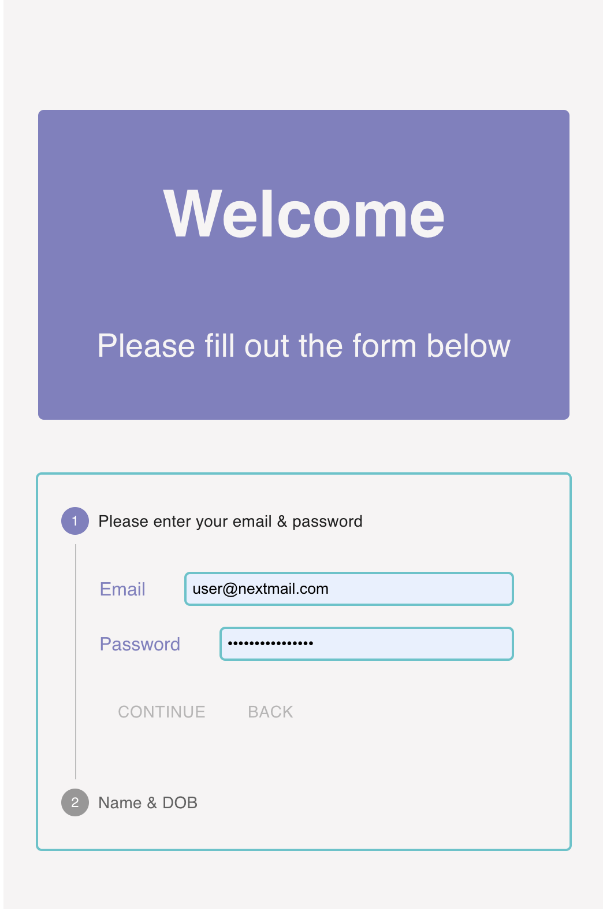
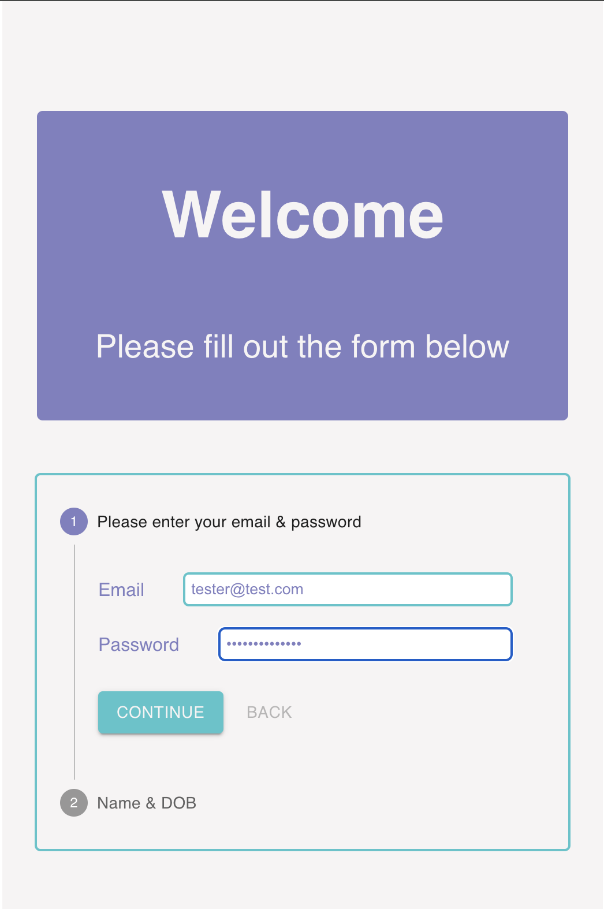
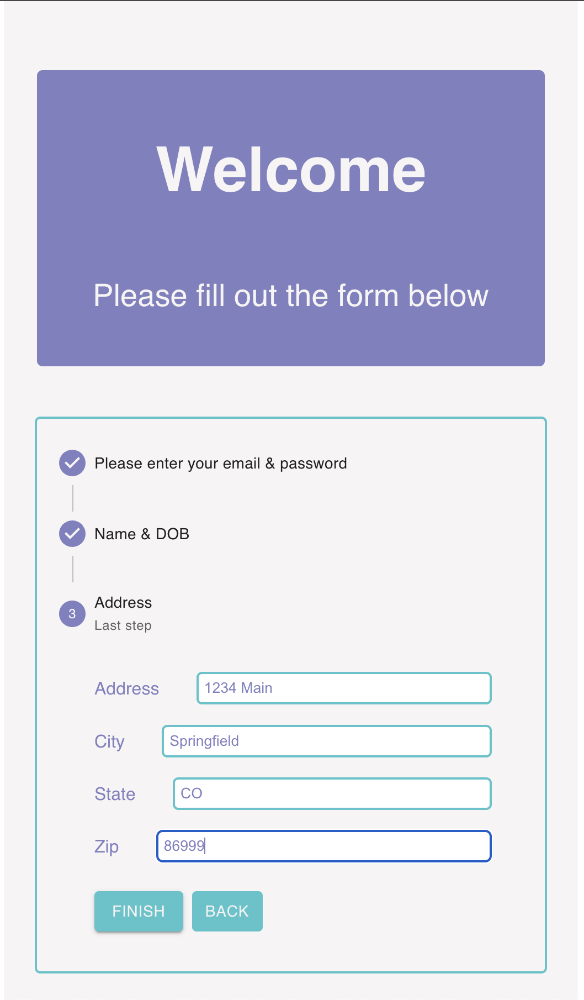

# Assessment form

This is a form built for a technical assessment for a new role.

The MVP specs were as follows:
* Build a multi-step form to create a new user account
* Step 1. Email + Password (min 8 chars, at least 1 number, at least 1 symbol)
* Step 2. First name, Last name, Date of Birth, checkbox that toggles entering optional Address (street, city, state, zip code)
* Submit the form as a POST request to https://httpstat.us/random/201,500
  * use the ‘Accept: application/json’ header
  * more details on https://httpstat.us/
* Parse the response and display a basic success / error message to the user
  * Can be on the same page
* Design:
  * Can leave completely unstyled
* Functionality:
  * All fields are required unless otherwise indicated
  * A user should see validation errors

## Design Notes
* **ReactJS:**  Since this is my core competency, I went with React to meet the basic requirements.  Other options I would have considered if there were more detailed specs would have been React Native (if we were building exclusively for mobile) and NextJS (if we were building for web and looking to leverage SSR or a mix of CSR/SSR).
* **TypeScript:** Probably not really need for such a small project, but I would have to assume a form would be part of a larger platform/app, so type safety would be important.
* **Formik:**  React is notoriously boilerplatey when it comes to building forms, and Formik really simplifies this.  That being said, React 19 is showing some promising new features for forms, including form actions and useFormStatus that may impact this decision in the future.
* **Yup:**  Simplifies form validation and it works hand-in-glove with Formik
* **Material UI:** A quick and easy way to build the stepper for the form.  There are other component libraries that have steppers that I could have just as easily used, but I liked the aesthetics for this one and how it looked/functioned was not detailed in the specs.  In an enterprise environment, I would consider more based on an established style guide or even look at building a component library myself, depending on the needs of the team.

## Style Notes
* The specs did not require styles, but as a UI guy, I had to add something to make it look decent.  I copied some of the color theming from the prospective company's website.

## Stretch Features
* **Testing:** I plan to return to this and add testing, most likely React Testing Library.
* **Functionality:** 
  * **Adding a form summary:**  I'm not thrilled with how the previous responses are hidden as you move through the steps.  If this was for a form this size, I might look at the completed field values remaining visible below the title of the step they were in (the user would still need to navigate to a previous step to edit).  If this was a larger form, like a medical intake for instance, I would explore having some sort of "document" display next to the form.  At the very least, I would look at having some sort of form summary in the submit step.
  * **Smoother review experience:**  Right now, if you have filled out the form and choose to "review and edit", the form resets.  I'd update this to persist user inputs for review.
* **Styles:**  If this was part of a larger project, I would consider Tailwind if that aligned with the team's style guide, or if we needed something more robust and granular, Sass.

## How to run
Note: this project requires [Node.js](https://nodejs.org/en/) to run
1. Clone this repo (if you received a zip file, extract the files from that) into a directory on your local machine.
2. Navigate to that directory in a terminal
3. Use `npm install` in that directory to install dependencies
4. Use `npm run start` to spin up your dev server and run the app
5. Navigate to `http://localhost:3000/` in a browser to see the app

